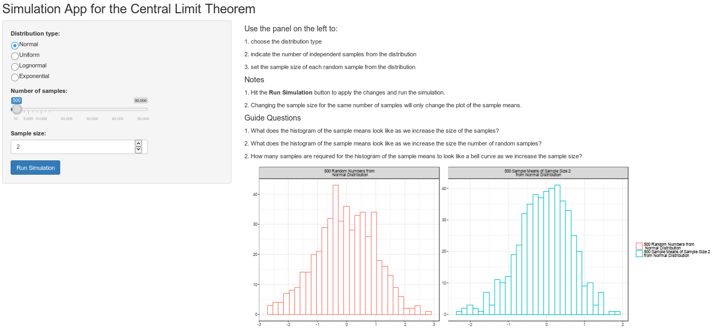

```{r setup, include=FALSE}
knitr::opts_chunk$set(echo = FALSE)
```

## What is the "Central Limit Theorem App?"

Oftentimes, teachers struggle to explain the central liimt theorem (CTT) to students. This concept is at the heart of inference and should be made clear as early as possible. 

Using the Central Limit Theorem App, students can see how the histogram of the sample means from any of the four provided distributions approach the "bell shape" curve as the number of samples is increased. 

The same app also enables us to show the rate of convergence to the bell shape curve of the histogram of the sample means as we increase the sample size.

## Portion of code for `server.R`

```{r, eval=FALSE, echo=TRUE}
# This is the server logic for a Shiny web application.

library(shiny)
library(dplyr)
library(tidyr)
library(ggplot2)

shinyServer(function(input, output) {
  output$distPlot <- renderPlot({
    
    # capture inputs
    nobs <- input$nobs
    sampsize <- input$sampsize
    disttype <- input$dist
    dist <- switch(disttype,
                   Normal = rnorm,
                   Uniform = runif,
                   Lognormal = rlnorm,
                   Exponential = rexp,
                   rnorm)
    
    set.seed(nobs)
    # generate nobs random numbers from the chosen distribution
    rnos <- dist(nobs)
    
    # create vector of sample means from the nobs random numbers
    sampleMeans <- c(rep(0, times=nobs))
    for (i in 1:nobs){
      sampleMeans[i] <- mean(sample(rnos, sampsize), replace = TRUE)
    }
    
    # create panel for two side-by-side plots
    # of the nobs observations from the distribution
    # and the nobs sample means of sampsize size
    
    df <- data.frame(
      rnos ,
      sampleMeans) 

    df %>%
      gather(samp, value, rnos:sampleMeans) %>%
      mutate(
        samp = factor(samp, 
                      labels = c(
                        paste(nobs, "Random Numbers from\n", disttype, "Distribution"), 
                        paste(nobs, "Sample Means of Sample Size", sampsize, "\nfrom", disttype, "Distribution")))) %>%
      ggplot(aes(value, color = samp)) + 
      geom_histogram(fill = "white", bins = min(30, nobs / sampsize)) + 
      facet_wrap(~samp, scale = "free") +
      theme_bw() + 
      xlab("") + 
      ylab("") + 
      theme(legend.title=element_blank())
      ##dist size, parameter from slider
  })
}
)

```


## The app interface

The figure below shows the interface of the app.

```{r, out.width = "880px", fig.align='center'}

```

## Do you want to try the app?

The app is available in this link: https://jtabadero.shinyapps.io/coursera_developing_data_products_final/

If you want to improve the app, you can head on to the github repository: https://github.com/josephuses/coursera_developing_data_products_final


